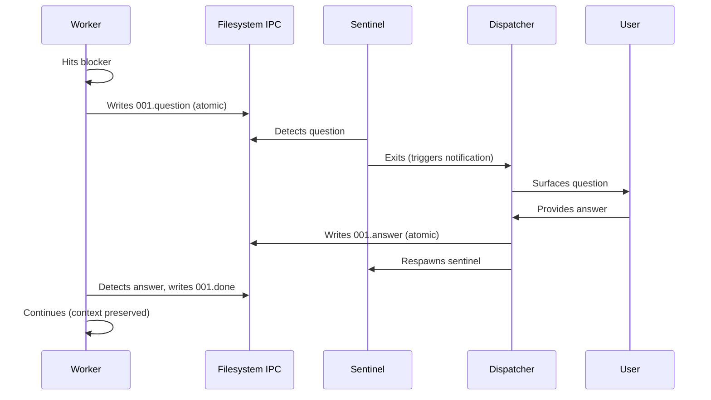

Claude Code sessions have a fixed context window. Every task you work on fills it up. Review some code, write tests, refactor a module, debug an API endpoint. By the third or fourth task, the model starts losing nuance on the earlier ones. By the fifth, you're compacting or starting a new session entirely.

This is the actual bottleneck in AI-assisted development right now. Not model quality. The models are genuinely great. The bottleneck is twofold: your single session can only hold so much before it degrades, and _you_ can only track so many parallel workstreams before you lose the thread.

I built [Dispatch](https://github.com/bassimeledath/dispatch) to solve both of these at the same time.

## The real constraint isn't intelligence

When people hear "multiple background agents," they roll their eyes. Everyone is doing that now. Open five terminals, run `claude --background` in each, check back later.

But that framing misses what actually breaks down. The problem is not "can I run things in parallel." The problem is:

1. **Your main session fills up.** Every task you work on consumes context. The more ambitious your session, the faster it saturates. Once it's full, the quality of every subsequent response degrades.
2. **You become the bottleneck.** With five background agents, _you_ are the orchestrator. You're tracking which terminal is doing what, checking on progress, noticing failures, deciding what to do next. The cognitive load scales linearly with the number of agents.

Dispatch solves both. Your session becomes a lightweight mediator that plans and delegates. The actual implementation work happens in fresh, isolated worker contexts. And the dispatcher (not you) carries the coordination overhead.

## 10x your effective context

Without Dispatch, you have one context window shared across every task. Each task consumes a chunk. Want to review code, write tests, refactor a config layer, update docs, and debug an API? That's one window doing all five. By the time you're on task four, the model's recall of task one is degraded.

With Dispatch, every task gets its own dedicated context window. Your main session only holds orchestration overhead: the plan files, status updates, and your decisions. That's maybe 10% of a window per task.

The math is straightforward. Instead of cramming five tasks into one window, you get five dedicated windows working in parallel, plus your orchestration window stays lean enough to keep dispatching indefinitely. Your effective working context goes from 1x to roughly 10x.

```
/dispatch use opus to review this PR for edge cases
/dispatch use sonnet to write integration tests for the payment flow
/dispatch use gpt-5.3 to refactor the config parser
```

Three tasks. Three fresh context windows. Your main session barely noticed.

## The cognitive load shift

This is the part that matters more than most people realize.

With `claude --background`, multiple terminal tabs, or fire-and-forget agent runners, the parallelism is real but the bottleneck just moves. Now _you_ are the orchestrator. You're tracking which terminal is doing what, checking on progress, noticing when something fails, context-switching between outputs. The cognitive load is entirely on you.

This is why "just run more agents" doesn't actually scale. Your brain becomes the limiting factor. You can reliably juggle maybe 3-4 active agent threads. Past that, you start forgetting what context each model had, what you already asked for, which output to trust.

Dispatch moves the coordination burden to the AI dispatcher. The dispatcher tracks all workers, surfaces questions when they arise, reports completions, handles errors, and offers recovery options. Your role reduces to two things:

1. Describe what you want
2. Answer questions when asked

That's it. You don't poll. You don't check. You don't track. The dispatcher does all of that, and its capacity for tracking parallel workstreams is orders of magnitude higher than yours.

## Workers ask questions back

This is the design choice that separates dispatch from fire-and-forget systems.

When a worker gets stuck, it doesn't silently fail or hallucinate an answer. It asks a clarifying question. The dispatcher surfaces it to you, you answer, and the worker continues without losing context. No restart. No re-explaining. No lost work.

```
Worker is asking: "requirements.txt doesn't exist. What feature should I implement?"
> Add a /health endpoint that returns JSON with uptime and version.

Answer sent. Worker is continuing.
```

The moment a worker is dispatched, your session is immediately free. Dispatch another task. Ask a question. Write code. Workers run in parallel and results arrive as they complete. If a worker needs your input, the dispatcher surfaces it. Otherwise, you're uninterrupted.

## How it works

Three design choices make this system hold together.

### Checklist-as-state

The plan file IS the progress tracker. No databases, no signal files. Just a markdown checklist that the worker updates in place:

```
# Security Review
- [x] Scan for hardcoded secrets
- [x] Review auth logic
- [ ] Check dependencies ← worker is here
- [ ] Audit injection risks
- [ ] Write findings report
```

You can read it anytime. It's human-readable, debuggable, and git-friendly. That's the entire state management layer.

### Filesystem IPC

When a worker gets stuck, it shouldn't have to exit and lose its entire context window just to ask a question. Instead, workers write questions to numbered files, a lightweight sentinel detects them and notifies the dispatcher, you answer, and the worker continues with full context preserved.



If no answer comes within 3 minutes, the worker gracefully dumps its context to a file and exits. The next worker picks up where it left off.

### Model-agnostic routing

Any CLI that accepts a prompt can be a worker. The config is model-centric. Adding a new model is one line:

```yaml
models:
  opus:            { backend: claude }
  sonnet:          { backend: claude }
  gpt-5.3-codex:  { backend: codex }
  gemini-3.1-pro:  { backend: cursor }
```

On first run, Dispatch auto-detects your installed CLIs, discovers available models, and generates the config. Zero manual YAML.

## Getting started

```shell
npx skills add bassimeledath/dispatch -g
```

Then:

```
/dispatch "refactor the auth module"
```

Mix models per task. Claude for deep reasoning, GPT for broad generation, Gemini for speed. Reference any model by name.

## The shift

The pattern in AI-assisted development has been clear: 2024 was autocomplete, 2025 was pair programming, and 2026 is coordination. The right form factor is no longer you managing terminal tabs and context-switching between agents. It's letting AI handle the delegation too, because the models are good enough now to coordinate themselves.

One dispatcher, many workers, and you in the loop for the decisions that matter.
