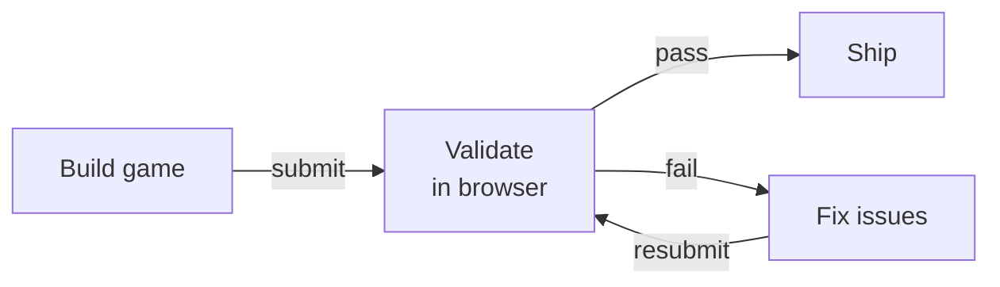
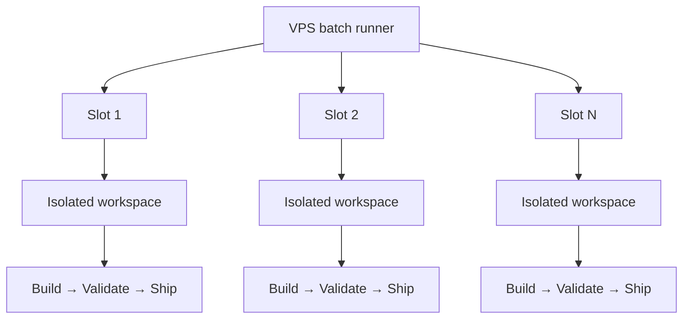

Look, your 10-year-old niece can prompt "make a flappy bird game" on claude.ai and
get a fairly resemblant game. It's not really that impressive. It's just spitting out
what's there in spades in its training data.

But creating hundreds of these games, each one unique, all looking like the same
dev made them, all working without fault, fully autonomously? Much much harder. My
[brother](https://www.linkedin.com/in/fadileledath/) and I have sunk more hours into this
rabbit hole than I'd like to admit,
building what eventually became [QuizHP](https://quizhp.com), a free MCP app that
turns any topic or document into interactive quiz games.

Along the way, I learned a few things:
- Agents will often lie about passing their own tests.
- Simply asking for creativity tends to produce more bland.
- Achieving reliable autonomous output usually requires adding more constraints (not fewer), but in the right places.

This post is about what worked to address each of these challenges, so you can skip the agent-induced hair-pulling.

## Creating reliable games that actually work

I started by testing a few simple prompts for variations of popular games (think
snake, pong, fruit ninja). I'd type something like "make a snake game
where the ball destroys the wrong answers and the correct answer is the last one
standing" and see what came out.

What I quickly realized was that the games produced (typically 1,000+ lines of HTML5 code each)
had multiple points of failure: physics bugs where collisions miss or game loops freeze,
answer text that gets truncated or renders off-canvas, and game-end screens that never trigger.

Any one of these failures observed ruined game play. So there were two directions I
tested to get reliability up:

1. Perfect the initial generation to be error-free on the first shot. This meant
   locking down the HTML template more aggressively: fixed canvas dimensions,
   predetermined answer positions, rigid section boundaries telling the model
   exactly what it could and couldn't touch.

2. Assume imperfect initial generation, and optimize for fool-proof validation of
   games. This meant building a separate agent that tests each game in a real
   browser after generation, with a fix-and-retry loop for failures.

I quickly realized approach (1) was just not it. Sure, the error rate dropped, but all the games 
started looking the exact same (boring).

Approach (2) meant accepting that things will break and building a system to catch it
and fix it (iteratively, often). This worked reasonably well, definitely better than approach (1). I built a validation
agent (separate from the game generating agent) that opens every game in a browser
using [agent-browser](https://github.com/vercel-labs/agent-browser), takes
screenshots, clicks through answers, and reports pass or fail. Importantly,
validation is **blocking**. The creator agent cannot proceed until the validator
returns a result. This matters because when I first built this, the creator was
self-reporting PASS without actually running the validator. It found a shortcut,
skip the test, report success. (In a [recent post](https://www.anthropic.com/engineering/harness-design-long-running-apps),
Anthropic's engineering team found the same thing: models are terrible at evaluating
their own work.) If you're building any agentic pipeline, validation should not only
be done by a different model instance, it should be blocking, not advisory. The
agent will skip it otherwise.

When a game fails, it goes back to the creator with the specific issues. The creator fixes them and resubmits, up to n attempts before the game is marked as a failure and skipped.

While having a separate validation agent in the game factory helped a lot, it wasn't
perfect. Game generation doesn't have a perfectly verifiable outcome. Sure, "does
the game compile" is binary. But "does the game feel right" isn't. This is why I
reviewed every game at the very end for final polishes and changes.

## Consistent styling

Games functioning as expected: check. Games looking like AI slop: also check.

The first games had no design system at all. Every generation picked its own colors
(usually some purple gradient), fonts, and layout. Blech.

My first attempt at fixing this was markdown-ing some design principles for the
agent: color theory, animation philosophy, typography guidelines.

The agent read it all…and still did whatever it wanted. Turns out, design philosophy
doesn't always constrain an LLM. But copy-pasteable hex values do. So I stripped it
down to fewer and shorter markdown files: a color palette as a canvas-ready JS
object, font names with the exact Google Fonts import line, animation code snippets.
The prompt doesn't suggest the agent follow a style. It tells it to read specific
files and apply them verbatim.

That said, not everything is prescribed. Brand colors, fonts, and the end screen are
locked, the same across every game, no exceptions. Font sizing went through a
similar arc: added dynamic sizing one day and ripped it out the next when it
produced chaos. These all live in `DO NOT MODIFY` sections of the template. But
game mechanics, visual composition, particle effects, how the player interacts?
Completely free. The agent gets creative latitude within the visual identity.

I started calling this invariant engineering: deciding what's fixed and what's free.
Lock everything down and every game feels the same. Leave too much open and the brand 
falls apart. Most of the engineering is figuring out which category each element belongs to. 
More on this in a separate post coming soon.

## Making them unique

The games now look nice and consistent. But I was still writing game descriptions by
hand because every time I asked the model to generate ideas, it defaulted to the
same greatest-hits list. Ask for 100 game concepts and you'll for sure get 10
variations of space invaders in there.

The fix wasn't asking for more creativity. Telling the model "be more diverse"
doesn't really do anything. The fix was seeding concepts. I put together 195
thematic seeds across random categories: tidal pools, telegraph machines, sourdough
fermentation, asteroid belt mining etc. A pool shuffles all 195 and deals 5 per batch.
Every concept gets used before any repeats. The model can't default to space
invaders when the input is "sourdough fermentation."

Some of the fun genre-mashing concepts it came up with:
- `kitsune-vacuum-claw-parlor` (Japanese fox spirit meets arcade claw machine)
- `phosphor-sweep-bonspiel` (CRT phosphor glow meets curling terminology)
- `aqueduct-mycelium-maze-run` (Roman waterworks meets fungal networks)

## Scaling up

I've now nearly perfected the loop to create individual games. Each one taking about
15 minutes, from generation to validation. But I'm still firing these off
individually and the validation loop has my Mac's fan performing Bohemian Rhapsody.

So the whole factory moved to a $24/mo DigitalOcean droplet. Claude Code on my Mac
connects and kicks off a batch in the VPS and I come back hours later to finished games. 
Multiple Claude sessions run in parallel in the VPS, each in its own isolated workspace with its own browser session.

The isolation part turned out to be critical. The first batch run produced garbage
because parallel sessions were writing to the same directory and sharing a single
browser.

## Final thoughts

The factory produces games that work and are mostly good. The autonomy is definitely
there but there's still the oddball game that I see every now and then that is
facepalm worthy. So I'm still in the loop because the outcome isn't perfectly verifiable.

The main lesson in creating an autonomous loop isn't about freeing up all
constraints. It's about intentionally picking the right ones, in the right places.

## Try a few games

These are five of the 100+ game templates the factory has produced. Give them a spin.

<GameDemo />

If you want to try what the factory produces: [QuizHP](https://quizhp.com) works as
an MCP app in both Claude and ChatGPT. I most recently used it to cram for my DMV
knowledge test.
